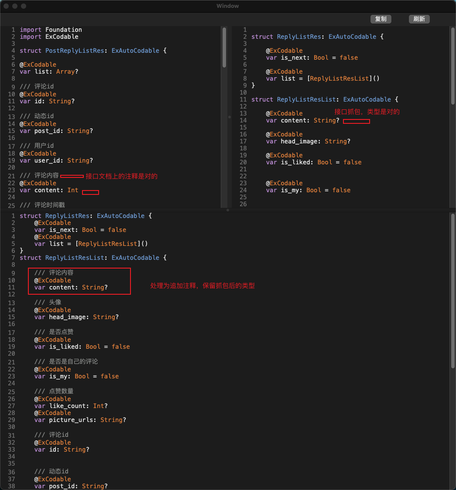

---
### 1.从接口文档上生成模型

这个可以自己写个谷歌插件，拦截文档网页内的接口实现

--- 
### 2.从抓包生成模型

可以用[JSONConverter](https://github.com/vvkeep/JSONConverter)，而[我fork的版本](https://github.com/songxing10000/JSONConverter)，追加了[ExAutoCodable](https://github.com/iwill/ExCodable)功能，在 
把文档上的注释追加到抓包后的模型上

---
### 3.效果

  
  